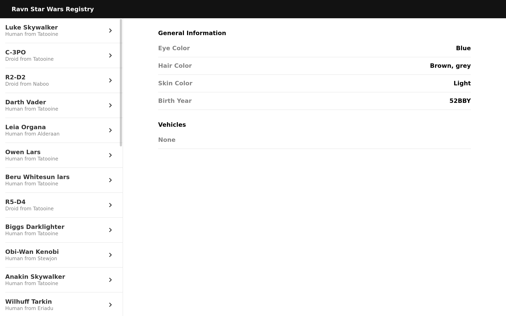

# Ravn Challenge V2

> This app is for Star Wars lovers that want to know more about their favorite characters. It was built in React using GraphQL and Apollo to fetch and control the flow of data retrieved.



## Built With

This project was built using the following technologies:

- HTML
- SASS
- ReactJS
- React-Router-Dom
- Prop-Types
- Apollo/Client
- GraphQL
- React-Waypoint
- FontAwesome
- Eslint
- Stylelint

## Getting Started

To get a local copy up and running follow these simple example steps

### Prerequisites

- A web browser
- Node.js
- A terminal
- Yarn installed

### Clone

- Clone with SSH:

```
git@github.com:jadx2/Ravn-Challenge-V2-Jaim-Delmar.git
```

- Clone with HTTPS:

```
https://github.com/jadx2/Ravn-Challenge-V2-Jaim-Delmar.git
```

### Usage

- Get to the root directory of the project:

```
  cd Ravn-Challenge-V2-Jaim-Delmar
```

- Install dependencies run:

```
  yarn
```

- Then star the server running:

```
  yarn start
```

- If it doesn't open automatically paste the following in your browser:

```
  http://localhost:3000/
```

## Contributors

👤 **Jaim Delmar**

- Github: [@jadx2](https://github.com/jadx2/)
- Twitter: [@thecatcodes](https://twitter.com/thecatcodes)
- LinkedIn: [@Jaim Delmar](https://www.linkedin.com/in/jaimdelmar/)

## :handshake: Contributing

Contributions, issues and feature requests are welcome!

Feel free to check the [issues page](https://github.com/jadx2/Ravn-Challenge-V2-Jaim-Delmar/issues).

## Show your support

Give a :star: if you like this project!

## Acknowledgment

Thanks to Ravn for the opportunity given and the project design.

## 📝 License

This project is [MIT](https://opensource.org/licenses/MIT) licensed.
